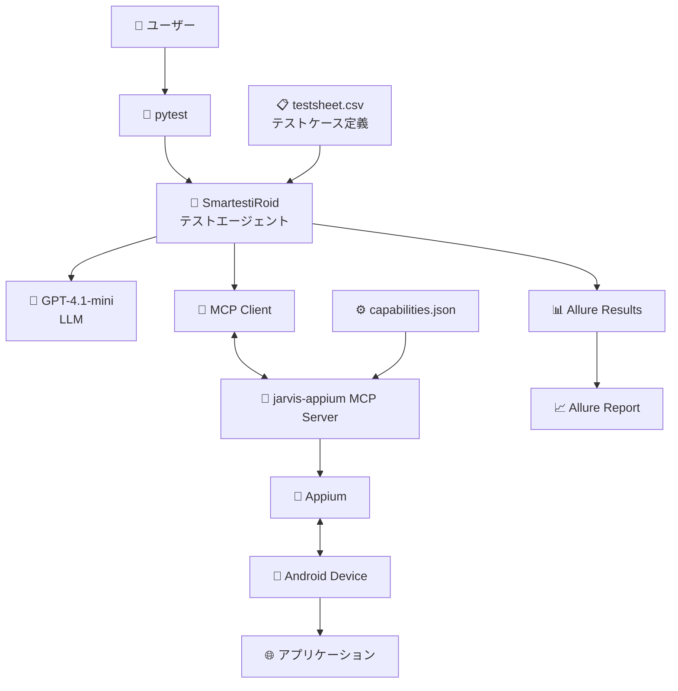

# Androidアプリ自動テスト & Allureレポート（SmartestiRoid サンプル）

このリポジトリは、**Androidアプリの自動テストをpytestで実行し、Allureでテスト結果を可視化する**ためのサンプルです。  
Androidテストやpytestが初めての方でも、手順通りに進めることで環境構築からテスト実行・レポート確認までを体験できます。

---

## 🚀 このリポジトリでできること

| 技術 | 役割 | 概要 |
|------|------|------|
| **pytest** | テスト実行 | Pythonベースのテストランナー。テストケースを自動的に実行します。 |
| **Appium** | モバイル自動化 | Androidアプリを操作・検証します。 |
| **Allure** | レポート生成 | テスト結果をグラフィカルに可視化します。 |
| **SmartestiRoid** | テストエージェント | LLMを利用してテストを動的に制御します。 |
| **LLM (GPT-4.1-mini)** | AI層 | テスト内容を理解し、柔軟なテストを計画・生成します。 |
| **MCP (Message Control Protocol)** | 通信層 | AppiumサーバーとSmartestiRoid間で指令を中継します。 |

---

## 🧩 システム構成図



### 各コンポーネントの役割

| コンポーネント | 役割 |
|----------------|------|
| **SmartestiRoid** | テスト全体を制御するエージェント。AIを活用して動的にテストを生成します。 |
| **pytest** | テスト実行ツール。Pythonで記述されたテストを管理・実行します。 |
| **MCP Server (jarvis-appium)** | Appiumと通信し、Androidデバイス操作を実現します。 |
| **Appium / Android Device** | 実際のモバイルアプリを操作します。 |
| **Allure** | テスト結果をHTMLレポートとして出力します。 |

---

## 🧰 前提条件

以下の環境をあらかじめ準備してください。

| 要素 | 推奨環境 |
|------|-----------|
| OS | macOS または Linux（Windowsも可） |
| Python | 3.11 以上 |
| Android Studio | 最新版（SDK と AVD を含む） |
| Allure | レポート生成用ツール |

### Allure のインストール例

macOSの場合:

```bash
brew install allure
```

Windowsの場合（Scoop利用）:

```bash
scoop install allure
```

---

## ⚙️ セットアップ手順

### 1. 依存パッケージのインストール

```bash
# Python仮想環境と依存ライブラリを同期
git clone https://github.com/aRaikoFunakami/smartestiroid.git
cd smartestiroid
uv python install
uv sync
```

---

### 2. Androidエミュレータの起動

1. 利用可能なエミュレータ一覧を表示  
   ```bash
   emulator -list-avds
   ```

2. `Pixel_Tablet`（またはお使いの環境名）を起動  
   ```bash
   emulator -avd Pixel_Tablet
   ```

3. コールドブート（スナップショットを使わずに起動）  
   ```bash
   emulator -avd Pixel_Tablet -no-snapshot-load
   ```

4. 初期化してブート（クリーン起動）  
   ```bash
   emulator -avd Pixel_Tablet -wipe-data
   ```

---

### 3. Androidテストサーバーの起動

SmartestiRoidと連携する改良版 `jarvis-appium` MCPサーバーを起動します。  
セットアップ詳細はこちらを参照してください：  
🔗 [mcp-appium (SmartestiRoid対応版)](https://github.com/aRaikoFunakami/mcp-appium/blob/testroid/install.md)

---

### 4. pytest でテスト実行

```bash
uv run pytest test_android_app.py
```

> 実行後、テスト結果は `allure-results/` ディレクトリに出力されます。

#### 🔹 特定のテストのみ実行する場合

1つだけ実行する場合:
```bash
uv run pytest test_android_app.py -k "TEST_0003"
```

複数のテストを実行する場合:
```bash
uv run pytest test_android_app.py -k "TEST_0003 or TEST_0004 or TEST_0005"
```

> `-k` オプションはpytestのフィルタ機能です。  
> テストケースIDをもとに動的に関数が生成されるため、`-` や空白は `_` に置き換えられます。

---

### 5. Allureレポートを表示

```bash
allure serve allure-results
```

ブラウザが自動で開き、テスト結果（成功・失敗・ログ・添付画像など）が確認できます。

---

## 🧭 トラブルシューティング

### 🔸 接続不良・リソースリークが発生した場合

エミュレータやAppiumとの接続トラブルが起きたら、ポートフォワード設定を確認・削除してください。

確認：
```bash
adb -s emulator-5554 forward --list
```

全削除：
```bash
adb -s emulator-5554 forward --remove-all
```

> 不要なポートが残っていると、MCPやAppiumが正しく接続できない場合があります。

---

### 🔸 プリインストールアプリ（例：Chrome）のデータ初期化

noReset設定が効かない場合、明示的にアプリデータをクリアします。

```bash
adb -s emulator-5554 shell pm clear com.android.chrome
```

アプリ一覧を確認する場合：
```bash
adb -s emulator-5554 shell pm list packages | grep chrome
```

---

## 📘 備考

- テストケースは `test_android_app.py` 内で **動的に生成** されます。  
- 詳細なAllureレポートの使い方は [Allure公式ドキュメント](https://docs.qameta.io/allure/) を参照してください。
- 問題がある場合は [issuesページ](https://github.com/aRaikoFunakami/test_robot/issues) に報告してください。

---

📍**最終目標:**  
このREADMEを読むだけで、  
「Androidアプリの自動テスト実行からレポート確認までを1人で再現できる」状態を目指します。