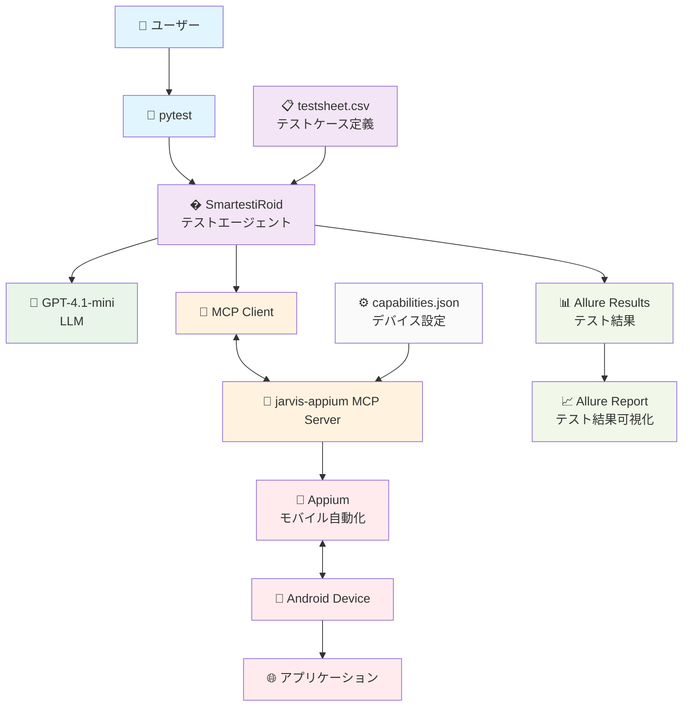

# Androidアプリ自動テスト & Allureレポート

このリポジトリは、Androidアプリの自動テストをpytestで実行し、Allureでテスト結果を可視化するためのサンプルです。

## アーキテクチャ図



## 構成

- `test_android_app.py` : Androidアプリの自動テスト（動的テスト関数生成）
- `allure-results/` : テスト実行後に生成されるAllureレポート用データ
- `conftest.py` : テスト共通処理（エージェント・セッション管理など）


## 実行手順

1. **依存パッケージのインストール**
      ```sh
      uv sync
      ```
2. **Emulatorを起動**

エミュレータ一覧を表示

```
emulator -list-avds
```

Pixel_Tablet (環境依存) というエミュレータを起動する

```
emulator -avd Pixel_Tablet
```

コールドブートする

```
emulator -avd Pixel_Tablet -no-snapshot-load
```

初期化してブートする

```
emulator -avd Pixel_Tablet -wipe-data
```

1. **Androidテストサーバーの起動**
      - 改変した `jarvis-appium` MCPサーバーを起動してください。
      - セットアップからサーバー起動までは下記のURLを参考のこと
      - https://github.com/aRaikoFunakami/mcp-appium/blob/testroid/install.md

2. **pytestで自動テスト実行**
      ```sh
      uv run pytest test_android_app.py
      ```
      - テスト結果は `allure-results/` ディレクトリに出力されます。

3. **実行するテストを指定する場合**

１つだけ指定する場合の例

```
uv run pytest test_android_app.py -k "TEST_0003"
```

複数指定する場合の例

```
 uv run pytest test_android_app.py -k "TEST_0003 or TEST_0004 or TEST_0005"
 ```

1. **Allureレポートの表示**
      ```sh
      allure serve allure-results
      ```
      - ブラウザでテスト結果の詳細（成功・失敗・ログ・添付ファイルなど）が確認できます。


## トラブルシューティング

### リソースリーク

Androidエミュレータやデバイスとの接続不具合が発生した場合は、以下のadbコマンドでポートフォワード状態を確認・削除してください。

1. **ポートフォワード状態の確認**
      ```sh
      adb -s emulator-5554 forward --list
      ```

2. **ポートフォワードの全削除**
      ```sh
      adb -s emulator-5554 forward --remove-all
      ```

これで不要なポートフォワードが解消され、接続トラブルが改善する場合があります。

### プリインストールアプリ (Chromeなど) のデータの初期化

アプリの「/data/data/<package_name>」配下を消去します。システムアプリやプリインストールアプリ（Chrome など）には noReset が効かないため、明示的に pm clear を使う必要があるケースがあります。

```
adb -s emulator-5554 shell pm clear <package_name>
```

Chromeの場合

```
adb -s emulator-5554 shell pm clear com.android.chrome
```

アプリ一覧から取得したい場合

```
adb -s emulator-5554 shell pm list packages | grep chrome
```

## 備考

- テストケースは `test_android_app.py` 内で動的に生成されます。
- Allureの詳細な使い方は [Allure公式ドキュメント](https://docs.qameta.io/allure/) を参照してください。

---
何か問題があれば [issues](https://github.com/aRaikoFunakami/test_robot/issues) へどうぞ。

