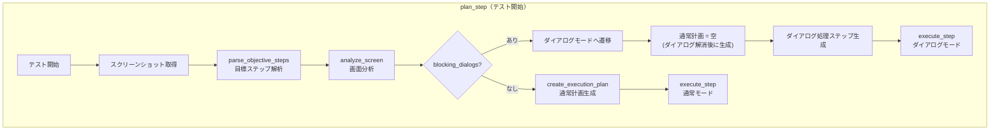
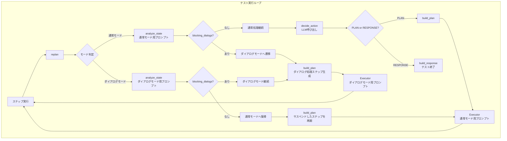
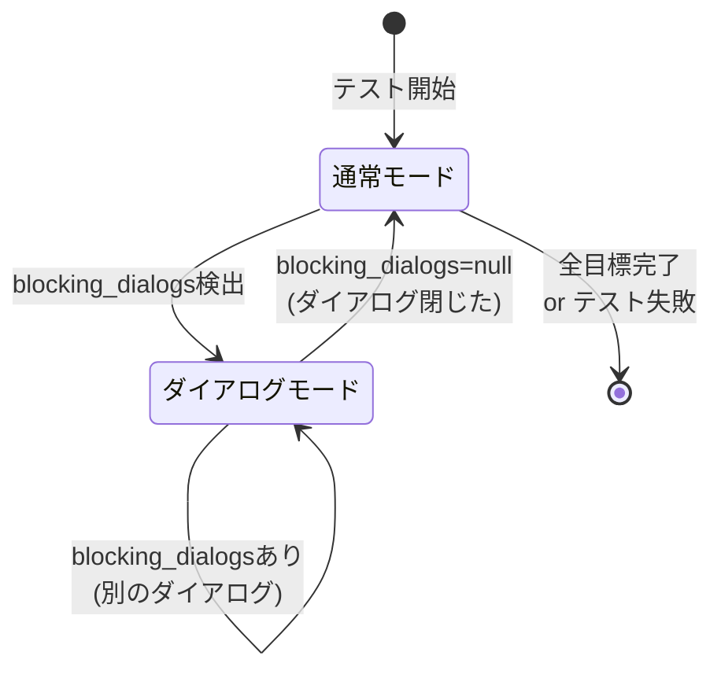
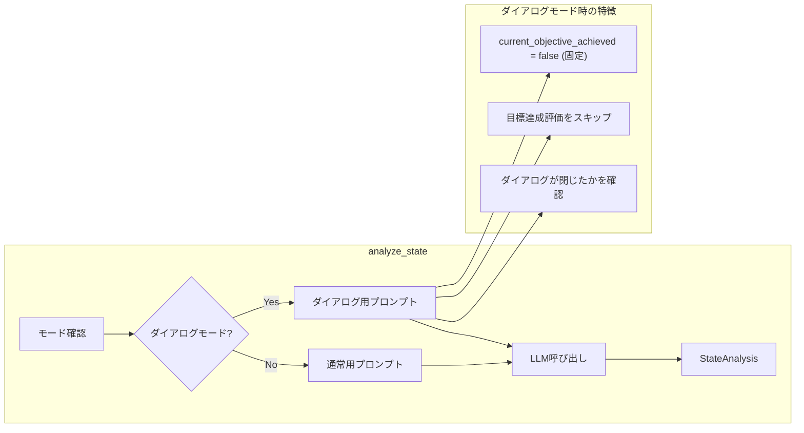
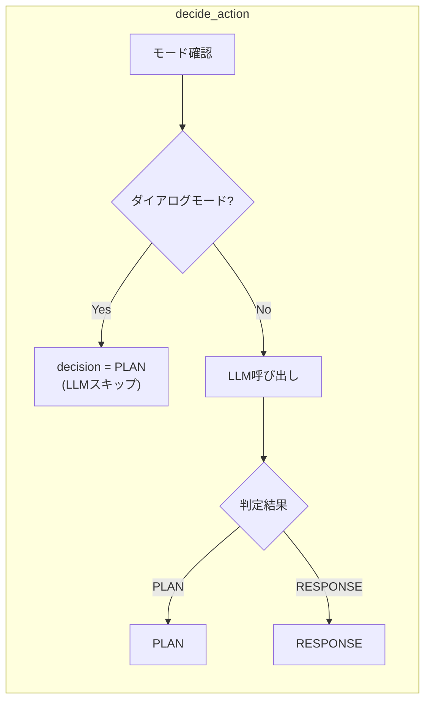
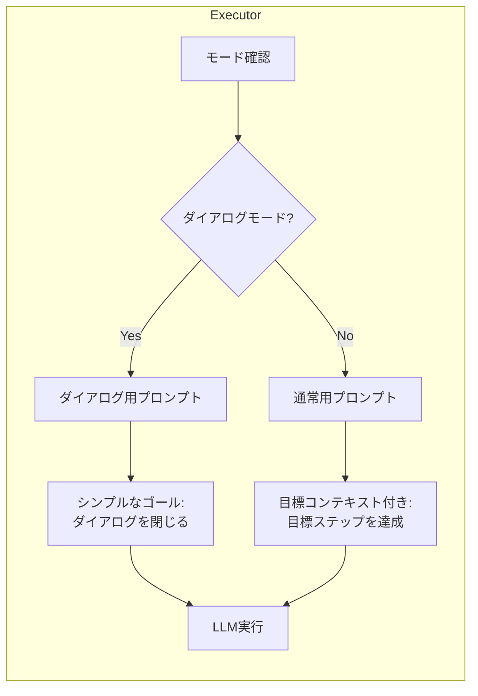
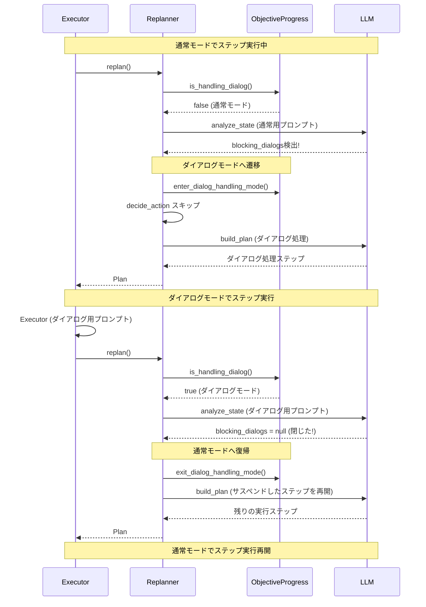
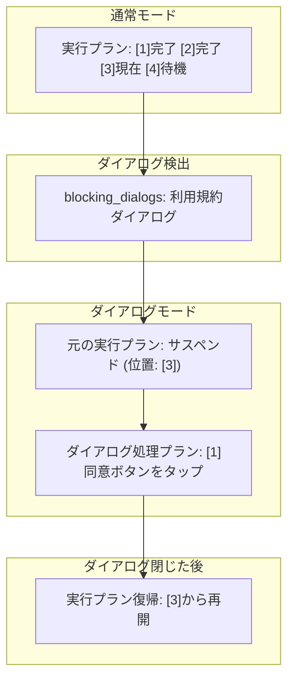

# ダイアログモード フロー説明書

## 概要

SmartestiRoidでは、テスト実行中にブロッキングダイアログ（利用規約、プライバシーポリシー等）が検出された場合、**ダイアログモード**に切り替えて処理を行います。本ドキュメントでは、モード管理の仕組みとフローを図解します。

---

## モードの種類

| モード | 説明 | 目標評価 | decide_action |
|--------|------|---------|---------------|
| **通常モード** | 目標ステップを達成するための処理 | ✅ 実施 | LLM呼び出し |
| **ダイアログモード** | ブロッキングダイアログを閉じるための処理 | ❌ スキップ | **スキップ** |

---

## plan_step からのフロー（テスト開始時）

テスト開始時の`plan_step`でもダイアログが検出される可能性があります。



### plan_stepでのダイアログ検出の特徴

| 項目 | 説明 |
|------|------|
| 分析メソッド | `analyze_screen`（`analyze_state`とは別） |
| 通常計画 | 空のまま（ダイアログ解消後に`replan_step`で生成） |
| モード遷移 | その場で`enter_dialog_handling_mode()` |
| 目標進行 | 目標進行ロジックが存在しないため問題なし |

---

## replan_step からの全体フロー



---

## モード遷移詳細



---

## 各コンポーネントの動作

### 1. analyze_state



### 2. decide_action



### 3. Executor



---

## ダイアログ処理の完全フロー



---

## 目標進捗管理

### セーフガード

ダイアログモード中、または`blocking_dialogs`がある場合は、LLMが誤って`current_objective_achieved = true`を返しても、目標ステップは進みません。

```python
# simple_planner.py
# ★セーフガード★ ダイアログモード中、またはblocking_dialogsがある場合は目標を進めない
has_blocking_dialogs = bool(state_analysis.blocking_dialogs)
if state_analysis.current_objective_achieved and not objective_progress.is_handling_dialog() and not has_blocking_dialogs:
    # 上記の条件が false になるため、ここには入らない
    objective_progress.mark_current_completed(evidence=evidence)
    objective_progress.advance_to_next_objective()
```

> **重要**: 最初のダイアログ検出時は、まだダイアログモードに入る前（analyze_state後にモード遷移するため）なので、`has_blocking_dialogs`のチェックが必要です。

### 実行プランのサスペンド



---

## ログ出力

### ダイアログモード開始

```
[DIALOG] [START] 🔒 ダイアログ処理モード開始
  blocking_dialogs: 利用規約ダイアログ、閉じるボタン: com.example:id/agree
  frozen_steps: 3
  target_objective: [0] アプリを起動する
  stop_position: ホームタブをタップ...
```

### ダイアログモード終了

```
[DIALOG] [END] 🔓 ダイアログ処理モード終了 → 通常処理に復帰
  dialog_steps_executed: 2
  remaining_steps: 3
  resume_position: ホームタブをタップ...
```

### decide_actionスキップ

```
[PLAN] [SKIP] 🔒 ダイアログモード: decide_actionスキップ
  mode: dialog
  decision: PLAN
  reason: ダイアログ処理モード中: ダイアログ処理を継続
```

---

## トラブルシューティング

### 問題: ダイアログモード中に目標が進んでしまう

**原因**: LLMが誤って`current_objective_achieved = true`を返した

**解決**: セーフガードにより防止済み
```python
has_blocking_dialogs = bool(state_analysis.blocking_dialogs)
if state_analysis.current_objective_achieved and not objective_progress.is_handling_dialog() and not has_blocking_dialogs:
```

> **補足**: 最初のダイアログ検出時に目標が進む問題は、`has_blocking_dialogs`チェックで防止しています。通常モード用プロンプトにも「blocking_dialogsがある場合はcurrent_objective_achieved = falseとする」ルールが追加されています。

### 問題: ダイアログが閉じたのに通常モードに復帰しない

**確認ポイント**:
1. `blocking_dialogs`が`null`になっているか
2. `exit_dialog_handling_mode()`が呼ばれているか

### 問題: ダイアログ処理が無限ループする

**確認ポイント**:
1. ダイアログを閉じるボタンのresource-idが正しいか
2. 同じダイアログが何度も表示されていないか

---

## 関連ファイル

| ファイル | 役割 |
|---------|------|
| [multi_stage_replanner.py](../src/smartestiroid/agents/multi_stage_replanner.py) | analyze_stateのモード別プロンプト |
| [simple_planner.py](../src/smartestiroid/agents/simple_planner.py) | decide_actionスキップ、セーフガード |
| [workflow.py](../src/smartestiroid/workflow.py) | Executorのモード別プロンプト |
| [progress.py](../src/smartestiroid/progress.py) | ObjectiveProgress、モード管理 |
| [dialog_mode_design.md](dialog_mode_design.md) | 設計書 |
